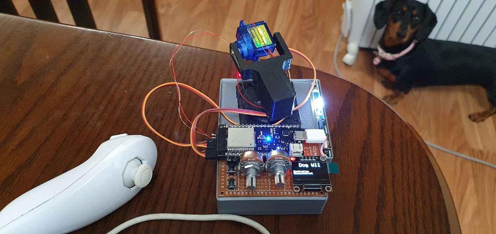

# Dog-Laser

This project was designed for my little dog called Luna who love chasing laser pointer.

So I created one that plays with her. For her safety, this laser is power adjustable and moves with different speeds and effects. Also, it allows me to coontroller the laser pointer with an external controller (Wii nunchuk).

This project was 3D/hardware/firmware designed 100% by me. The firmware implementation is done with embeded C++ and FreeRTOS on the ESP32 microcontroller.

Este hardware possui baterias recarregáveis e uma caixa para acomodar o hardware e os motores a laser.

How it looks like:

